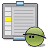
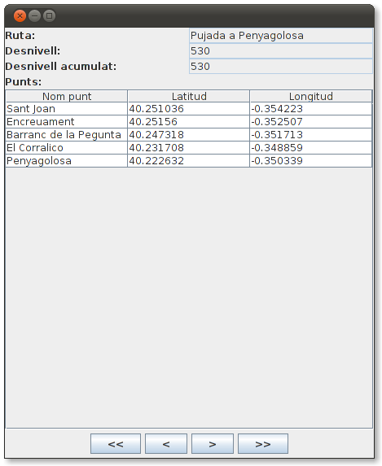

# Exercicis

##  Exercici 6.1

Crea un nou paquet anomenat **exercicis** en el projecte **Tema6**. Incorpora
en el projecte el driver per a **DB4O** , sino el tenies incorporat.

  * Copia el paquet **util.bd** al projecte. Aquest paquet el vam fer en l'exercici **T4Ex4** i inclou les classes **Coordenades.kt** , **PuntGeo.kt** i **Ruta.kt**. També inclou la classe **GestionarRutesBD.java** , que ens permetia gestionar la BD **Rutes.sqlite**
  * Copia també la BD **Rutes.sqlite** , creada en exercicis anteriors, però que l'última actualització és del mateix exercici.
  * Incorpora el driver de SQLite
  * Hem de canviar la definició de les propietats de la classe **Ruta** , ja que ara hem de permetre valors nuls per a poder fer consultes pel mètode **queryByExample()**. La manera més senzilla segurament serà:

    
```  
    class Ruta (var nom: String?, var desnivell: Int?, var desnivellAcumulat: Int?, var llistaDePunts: MutableList<PuntGeo> = mutableListOf<PuntGeo>()): Serializable 
```
  * D'aquesta manera, per a crar un objecte **Ruta** que estiga totalment buit, ho faríem així: **Ruta(null,null,null)**
  * Podria ser que aquest canvi en la definició de les propietat de **Ruta** provoque algun error en **GestionarRutesBD**. Si és així corregeix-los

A partir d'aci comença realment l'exercici, que consistirà en passar les dades
des de **Rutes.sqlite** fins la Base de Dades de **DB4O** **Rutes.db4o**.

  * Crea't el programa **Ex1_PassarRutaSqliteDB4O.kt**. 
    * Has d'agafar totes les rutes de Rutes.sqlite i deixar-les en un ArrayList de Ruta amb el mètode ja creat de **GestionarRutesBD.java** anomenat **llistat()**.
    * Insereix totes les rutes en la BD **Rutes.db4o**.
    * Tanca la connexió.
  * Crea la classe **Ex1_VisRutaDB4O.kt** , que ha de connectar a la Base de Dades **Rutes.db4o** , ha de llegir totes les rutes (ves amb compte, perquè només has de llegir rutes; s'han guardat més objectes: punts i coordenades) i ha de traure per pantalla el nom de la ruta i el número de punts.

>>>


##  Exercici 6.2

En el mateix projecte i paquet anem a fer una aplicació amb interfície
gràfica atancant a DB4O.

El programa mostrarà una ruta, i hi haurà també uns botons per anar a la
primera, anterior, següent i última ruta. Hi ha també el botó de Tancar, que
tancarà la connexió amb la Base de Dades i eixirà del programa.

Per a omplir el JTable amb els punts, teniu un mètode que ho fa
automàticament: **plenarTaula()**. Observeu quin és el seu paràmetre.

De moment tindrà aquest aspecte:



en el qual, a banda de les etiquetes (**JLabel**) i quadres de text
(**JTextField**) tenim una taula (**JTable**) on col·locarem tots els punts de
la ruta (nom, latitud i longitud). Tots els controls són no editables, per a
no poder introduir cap informació.

Aquest seria l'esquelet del programa.

Copieu-lo en un fitxer Kotlin anomenat **Ex2_VisRutes_DB4O.kt** , i poseu les
sentències necessàries després dels comentaris:

    
    
    import java.awt.EventQueue
    import java.awt.GridLayout
    import java.awt.FlowLayout
    import javax.swing.JFrame
    import javax.swing.JPanel
    import javax.swing.BoxLayout
    import javax.swing.JComboBox
    import javax.swing.JButton
    import javax.swing.JTextArea
    import javax.swing.JLabel
    import javax.swing.JTextField
    import javax.swing.JTable
    import javax.swing.JScrollPane
    
    import util.bd.Ruta
    import util.bd.PuntGeo
    import com.db4o.Db4oEmbedded
    
    class FinestraComplet : JFrame() {
    	var llista = arrayListOf<Ruta>()
    	var numActual = 0
    
    	// Declaració de la Base de Dades
    
    	val qNom = JTextField(15)
    	val qDesn = JTextField(5)
    	val qDesnAcum = JTextField(5)
    	val punts = JTable(1, 3)
    	val primer = JButton(" << ")
    	val anterior = JButton(" < ")
    	val seguent = JButton(" > ")
    	val ultim = JButton(" >> ")
    	val tancar = JButton("Tancar")
    
    	init {
    		defaultCloseOperation = JFrame.EXIT_ON_CLOSE
    		setTitle("JDBC: Visualitzar Rutes Complet")
    		setLayout(GridLayout(0, 1))
    
    		val p_prin = JPanel()
    		p_prin.setLayout(BoxLayout(p_prin, BoxLayout.Y_AXIS))
    		val panell1 = JPanel(GridLayout(0, 2))
    		panell1.add(JLabel("Ruta:"))
    		qNom.setEditable(false)
    		panell1.add(qNom)
    		panell1.add(JLabel("Desnivell:"))
    		qDesn.setEditable(false)
    		panell1.add(qDesn)
    		panell1.add(JLabel("Desnivell acumulat:"))
    		qDesnAcum.setEditable(false)
    		panell1.add(qDesnAcum)
    		panell1.add(JLabel("Punts:"))
    
    		val panell2 = JPanel(GridLayout(0, 1))
    		punts.setEnabled(false)
    		val scroll = JScrollPane(punts)
    		panell2.add(scroll, null)
    
    		val panell5 = JPanel(FlowLayout())
    		panell5.add(primer)
    		panell5.add(anterior)
    		panell5.add(seguent)
    		panell5.add(ultim)
    
    		val panell6 = JPanel(FlowLayout())
    		panell6.add(tancar)
    
    		add(p_prin)
    		p_prin.add(panell1)
    		p_prin.add(panell2)
    		p_prin.add(panell5)
    		p_prin.add(panell6)
    		pack()
    
    		primer.addActionListener {
    			// instruccions per a situar-se en la primera ruta, i visualitzar-la
    
    		}
    		anterior.addActionListener {
    			// instruccions per a situar-se en la ruta anterior, i visualitzar-la
    			
    		}
    		seguent.addActionListener {
    			// instruccions per a situar-se en la ruta següent, i visualitzar-la
    			
    		}
    		ultim.addActionListener {
    			// instruccions per a situar-se en l'últim ruta, i visualitzar-la
    			
    		}
    		tancar.addActionListener {
    			// instruccions per a tancar la BD i el programa
    			
    		}
    
    		inicialitzar()
    		VisRuta()
    	}
    
    	fun plenarTaula(ll_punts: MutableList<PuntGeo>) {
    		var ll = Array(ll_punts.size) { arrayOfNulls<String>(3) }
    		for (i in 0 until ll_punts.size) {
    			ll[i][0] = ll_punts.get(i).nom
    			ll[i][1] = ll_punts.get(i).coord.latitud.toString()
    			ll[i][2] = ll_punts.get(i).coord.longitud.toString()
    		}
    		val caps = arrayOf("Nom punt", "Latitud", "Longitud")
    		punts.setModel(javax.swing.table.DefaultTableModel(ll, caps))
    	}
    
    	fun inicialitzar() {
    		// instruccions per a inicialitzar llista i numActual
    
    	}
    
    	fun VisRuta() {
    		// instruccions per a visualitzar la ruta actual (l'índex el tenim en numActual
    
    		ActivarBotons()
    	}
    
    	fun ActivarBotons() {
    		// instruccions per a activar o desactivar els botons de moviment ( setEnabled(Boolean) )
    
    	}
    
    }
    
    fun main(args: Array<String>) {
    	EventQueue.invokeLater {
    		FinestraComplet().isVisible = true
    	}
    }


##  Exercici 6.3 (voluntari)

Modificar la classe anterior per a incorporar també la **distància total de la
ruta**. Per a poder calcular-la ens ajudarem de la següent funció que calcula
la distància en quilòmetres entre dos punts, donant les coordenades (latitud i
longitud) dels dos punts: **Dist(lat1,long1,lat2,long2)**. Observeu que per a
calcular la distància de forma correcta hem de tenir en compte tots els punts
(si només tenim en compte el primer punt i l'últim, la distància d'una ruta
circular seria 0).

Podeu incorporar-la a la classe on esteu fent l'exercici
(**Ex2_VisRutes_DB4O.kt**).

    
    
    fun Dist(lat1: Double, lon1: Double, lat2: Double, lon2: Double): Double {
    
    	val R = 6378.137 // Radi de la Tierra en km
    	val dLat = rad(lat2 - lat1)
    	val dLong = rad(lon2 - lon1)
    
    	val a = Math.sin(dLat / 2) * Math.sin(dLat / 2) + Math.cos(rad(lat1)) * Math.cos(rad(lat2)) * Math.sin(dLong / 2) * Math.sin(dLong / 2)
    	val c = 2 * Math.atan2(Math.sqrt(a), Math.sqrt(1 - a))
    	val d = R * c
    	return Math.round(d*100.0)/100.0
    }
    
    fun rad(x: Double): Double {
    	return x * Math.PI / 180
    }

Aquest seria un exemple:


Llicenciat sota la  [Llicència Creative Commons Reconeixement NoComercial
CompartirIgual 2.5](http://creativecommons.org/licenses/by-nc-sa/2.5/)

